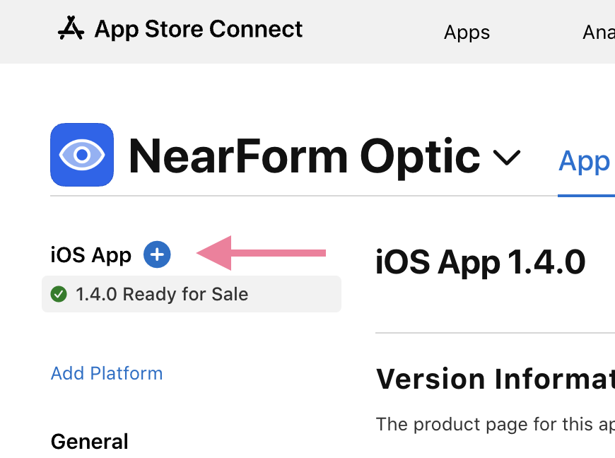
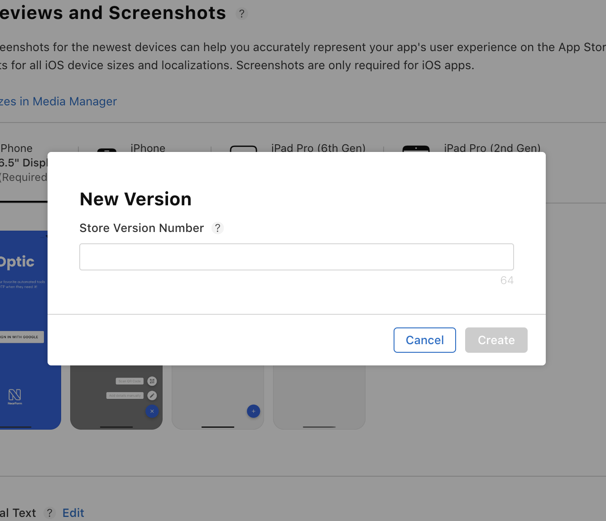
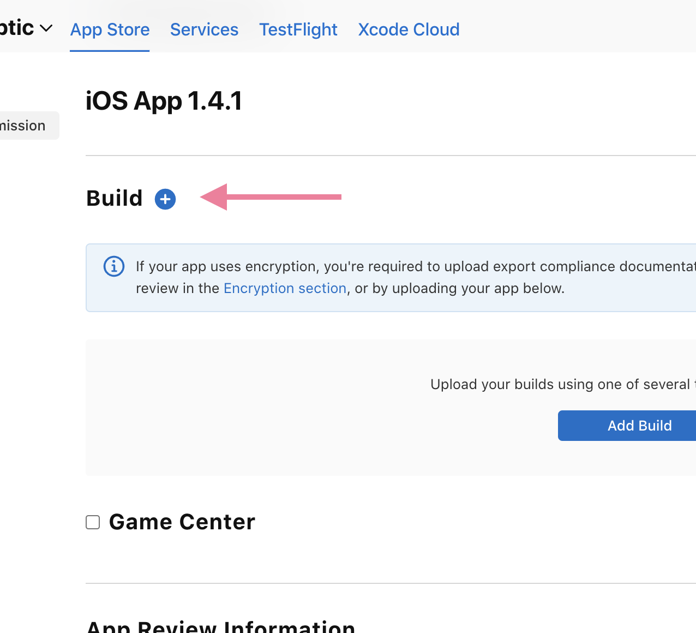
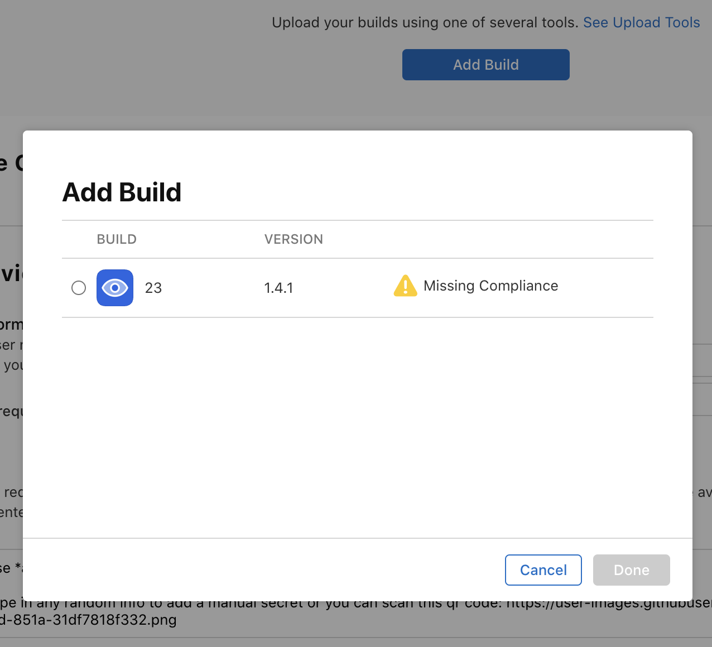
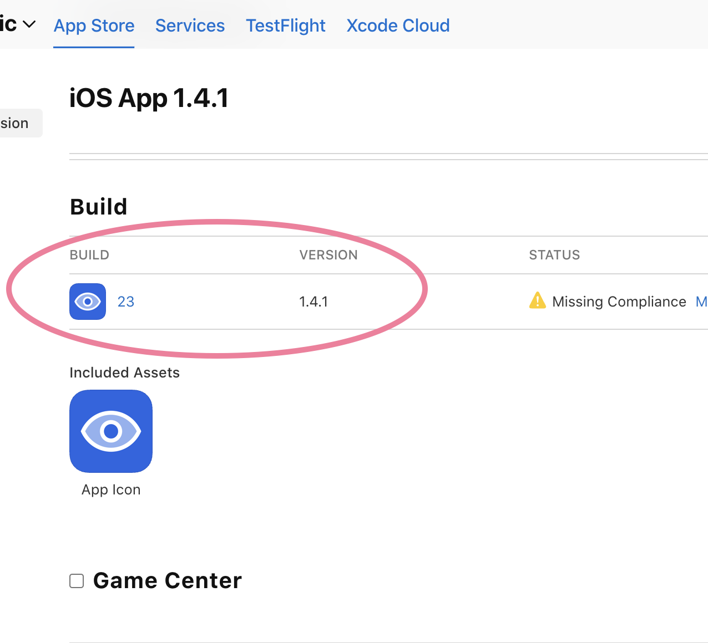
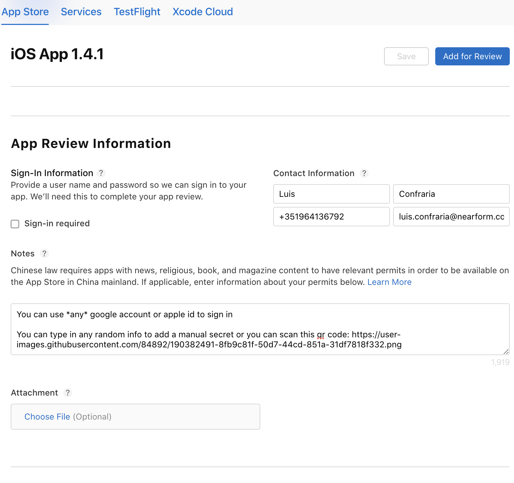
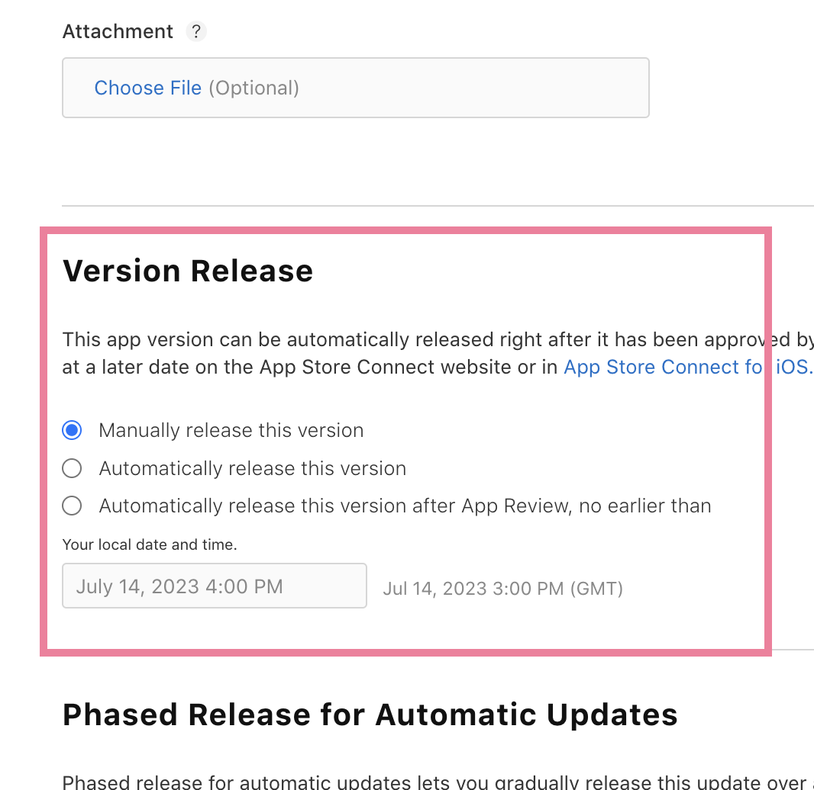
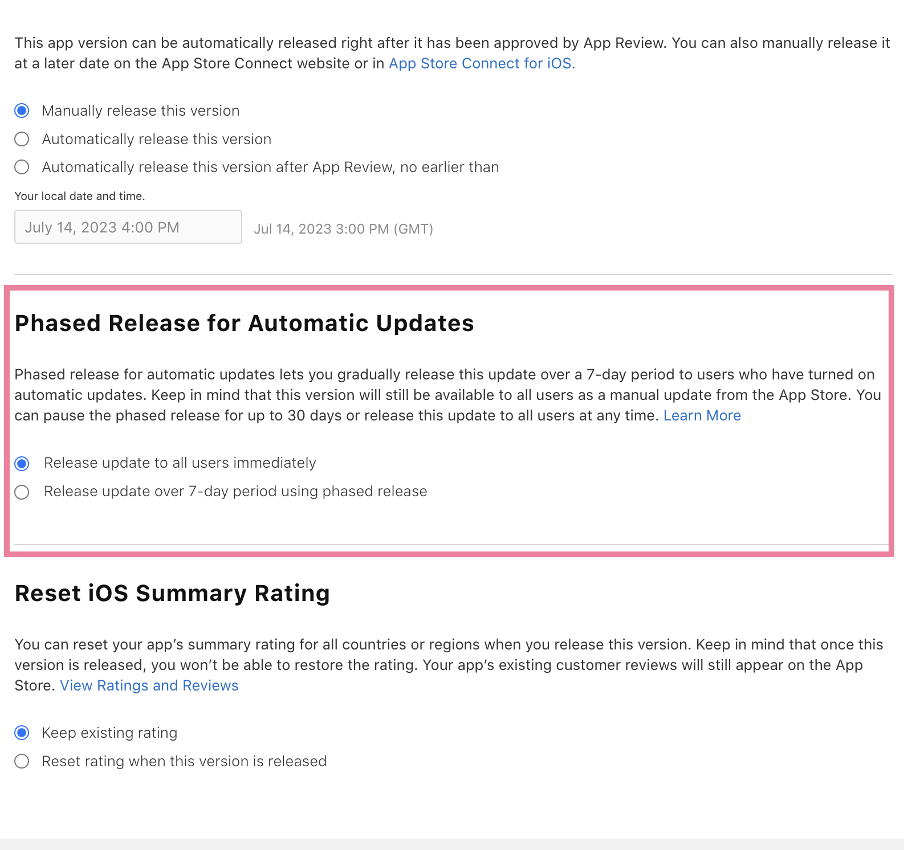
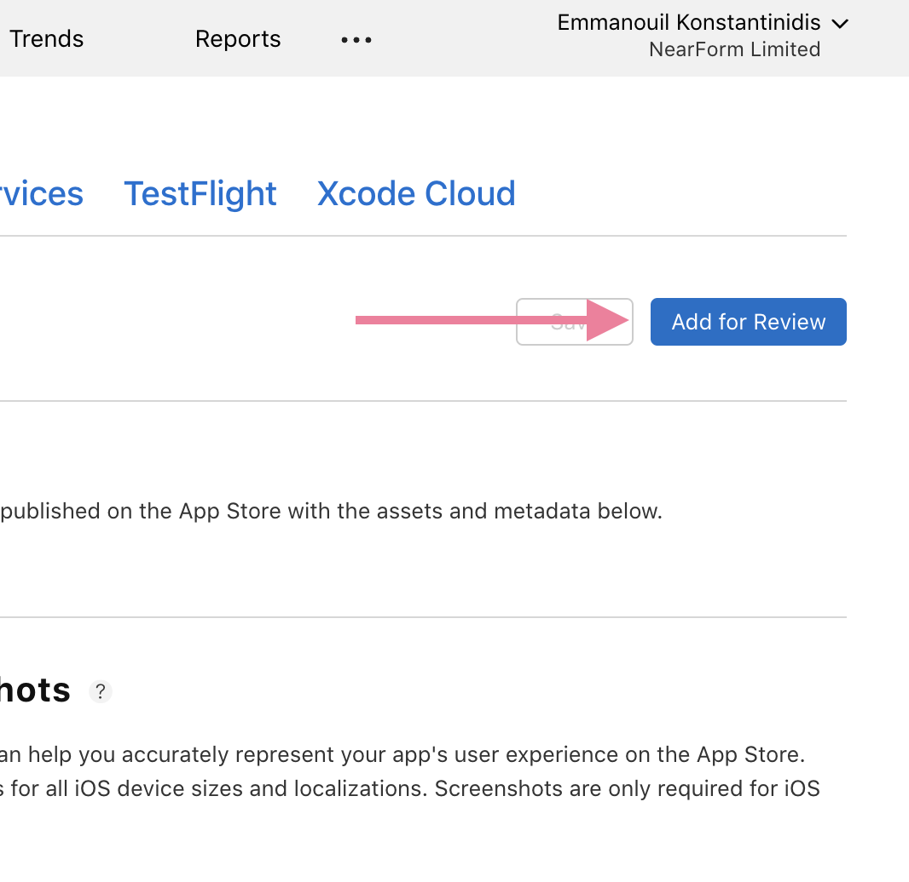
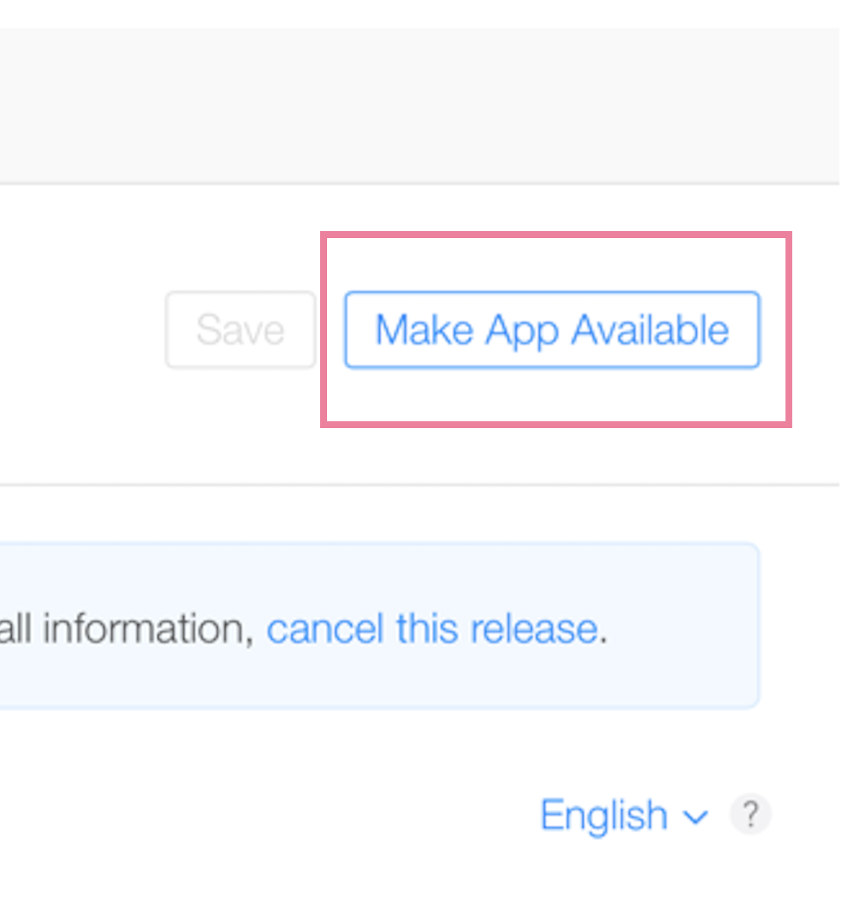

## Submitting for review

Once a build is available to the AppStore Connect and has finished processing (usually takes about 10-15 minutes from the time Expo shares the build), you can proceed to create the new version on the platform.

**Step 1**

**Step 2**

Next, enter the new version number. The version number should be incremental, so in most case it’s going to be a patch update. (i.e. from `1.4.0` to `1.4.1`)

**Step 3**

Now it’s time to prepare the new version for submission. The first step is to attach the build that Expo EAS generated. Scroll down to the “Build” section and press the **Plus(+)** icon.

**Step 4**

Select the build you would like to attach to this version and then press Done.

**Step 5**

You should now be able to see the selected build attached to the version you are preparing for submission.

**Step 6**

Ensure that the details required for the Apple Review team are up to date as they will reject the app if they are not able to login. To do so, scroll down to the “App Review Information” and confirm that the details are up to date.

**Step 7**

You can select to manually release this version, meaning that once the submission has been approved, you will have to login again to the platform and press the “Release to users” button, or you can also choose to make it available to users automatically, the moment it is approved by the Apple Review team.

**Step 8**

Depending on the type of the update, you might want to use a phased releases - to do so, scroll down to the “Phased Release for Automatic Updates” and select the relevant option. Phased rollouts on iOS means that the app will be released to 100% of the users gradually, over the next 7 days.

**Step 9**

Finally press “Add for Review” at the top right corner. Now it’s the Apple Review team’s turn to review the app. Nowadays it usually takes about 24-48 hours for them to review builds.

## Releasing to the stores

**Step 1**

If you selected “Automatically release this version” during the submission process, you don’t have to do anything else. Once the app is approved, it will show up in the stores in the next few hours -  it does takes some time for the store to make it available to everyone.

**Step 2**

If you’ve selected to “Manually releases this version”, then the app will be at a “Pending Developer Release” state, meaning you will have to log in and press the button that says “Make App Available”, on the top right corner.