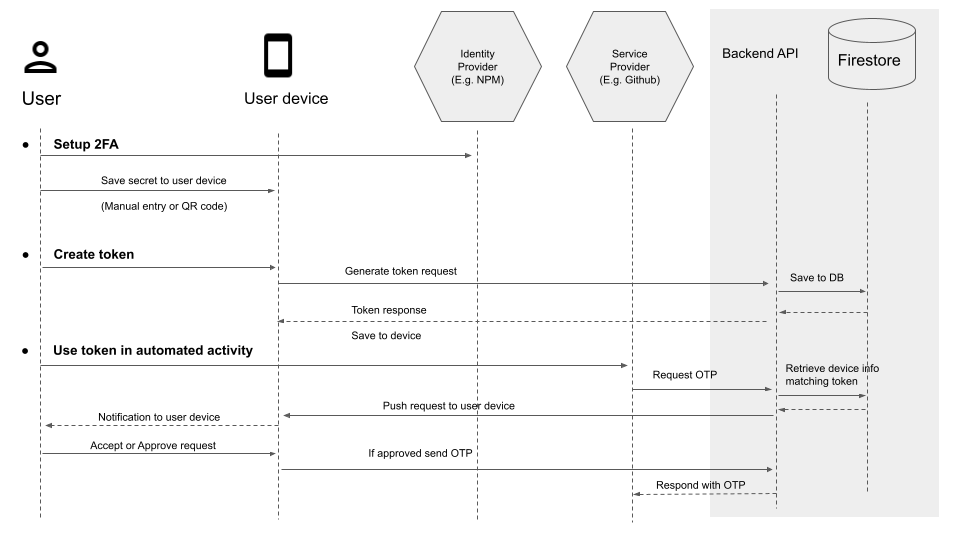

# Optic Expo

[Optic](https://expo.dev/@nearform/optic-expo) is an app that helps you securely generate OTP tokens for 2FA protected npm accounts. It allows auto-publish npm packages using CI.

## Requirements

- Node LTS
- yarn
- expo go app (on your ios/android phone or you can use the ios simulator)

## Setup

1. `yarn`
1. `yarn start`

## Development

In order to successfully run the Optic-expo app locally you will need the following:

1. Expo user account. You can sign up [here](https://expo.dev/signup).
1. Once you have an Expo account, your account needs to be added to the NearForm organization (ask @simoneb to do that for you).
1. Scan the QR code on your terminal or go to `exp://172.22.22.56:19000`
1. Once the app loads, if you get the signin screen, in your terminal run `expo login -u <username> -p <password>` and reload the app

## Running on a iOS device

1. Create an issue in this repo asking for apple connect developer access for the app (see section: [Providing Apple Developer Access](##providing-apple-developer-access))
1. Install expo-cli globally: `npm i -g expo-cli`
1. Run in the simulator first: `npm run ios`
1. Install [expo go](https://apps.apple.com/us/app/expo-go/id982107779) on your device
1. Connect the ios device to your mac and select trust computer when prompted.
1. Confirm your device is in [developer mode](https://developer.apple.com/documentation/xcode/enabling-developer-mode-on-a-device)
1. [Setup code signing certificates in xcode for developement](https://github.com/expo/fyi/blob/main/setup-xcode-signing.md)
1. In Xcode select your device as deployment target and select the development certificate (you may need to connect the device to your account if it was not done before)
   
1. Run: `expo run:ios --device`
1. Select your device from the list

## Setup Android Studio (MacOS)

1. Running `yarn android` will help you throughout the process.
1. Follow the [expo tutorial](https://docs.expo.dev/workflow/android-studio-emulator/).
1. Java Runtime will be necessary. OpenJDK version 11 worked. [Homebrew](https://formulae.brew.sh/formula/openjdk@11)
1. Read the output of the installation and execute the suggested commands related to symlink and including in the PATH variable.

## Setup Xcode/Simulator (MacOS)

1. Running `yarn ios` will help you throughout the following steps;
1. Create an Apple ID if you don't have one. If applicable, use your NearForm email.
1. Download Xcode from the App Store.
1. Open Xcode, navigate to "Preferences / Locations" and select the appropriate version in Command Line Tools.

## Providing Apple Developer Access

1. Login to Apple Developer using an account with "App Manager" role
1. You might need to use the nearform root account to provide permission above 'developer'
1. 'App Manager' role is needed if you want to give access to create new releases in play store
1. Navigate to [https://appstoreconnect.apple.com/access/users](https://appstoreconnect.apple.com/access/users)
1. Click on the "+" button on the top left corner and add the user info (most of the time will be developer or app manager) and choose what apps they have access to

## Notes

- The app doesn't run on the web
- `yarn start:native` is different from `yarn start` having the flag `--dev-client` you need to build a native version of the app as it generates a url like this:
  `com.nearform.optic://expo-development-client/?url=http%3A%2F%2F192.168.5.92%3A8081` so you have to run `expo run:android` first.
  exp://192.168.5.92:19000     As most things, it's a trade-off.Pp Without --dev-client it's faster to start working as you don't have to install native tools but it hides some problems that only occur in the native versions like the google login problem and the qr code scan.

## Figma Design

The figma designs can be found [here](<https://www.figma.com/file/xsPf6IIM9AevLN5gZlXM4q/Optic-(Copy)>)

## Sequence diagram

## User guide

The first step to use the `optic-expo` application is adding a Secret. You can add it by scanning a QR code provided by the OTP Issuer or by inputing it manually.

An example adding an NPM user secret:

You will see your secret added to the application home page:

Finally, you need to generate your `optic-token`s by adding a new token:

You can save this token to any system that need to sent to you a notification.
The notification will ask you to approve or deny the system's read to your Secret's OTP.

As you can see by the home page layout, you can generate many tokens to read the same Secret's OTP:

By doing so, you will be able to understand who is the caller that wants to read your OTP.

Few notes on the NPM secret:

- the NPM secret (QR or the textual code) is the one that you get, when you enable 2FA in your [npm](https://www.npmjs.com/) profile
- if you already have 2FA activated (with a different authenticatior app e.g. Google Authenticator) and you need to get the secret, the easiest way is to get is to open the authenticator app you were using previously and get the QR code from that app and scan it with Optic Expo
